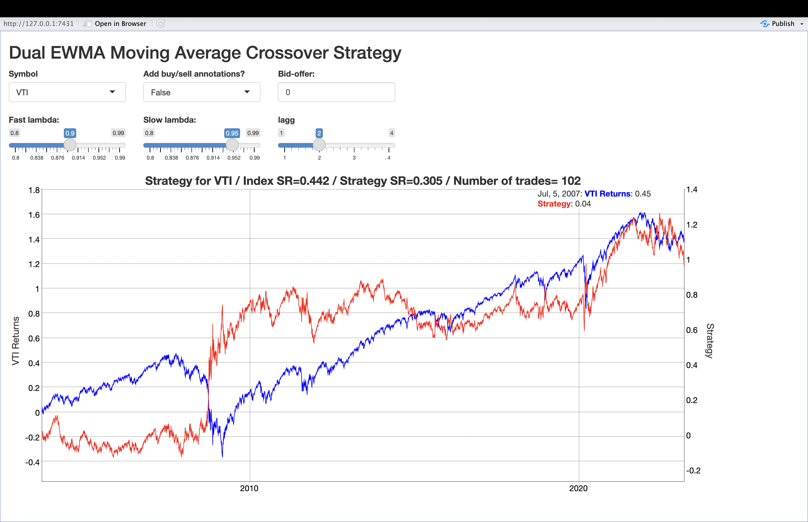
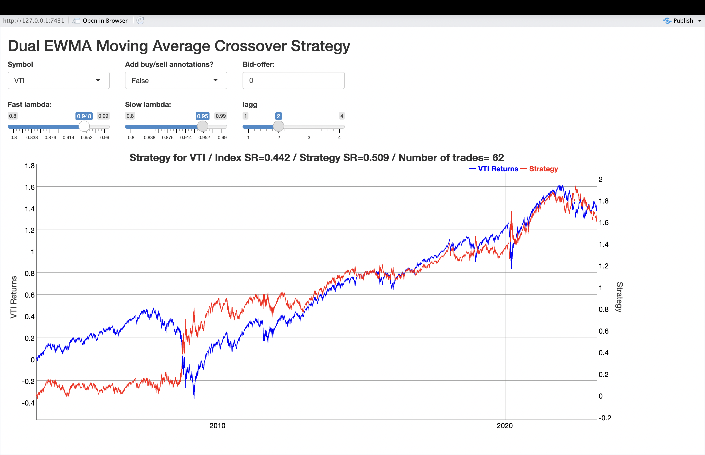
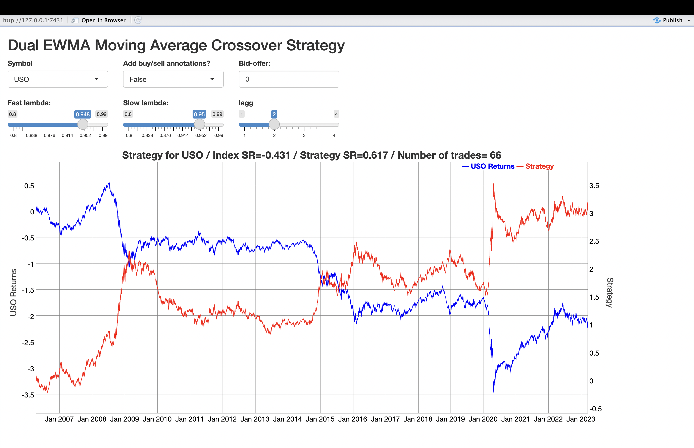
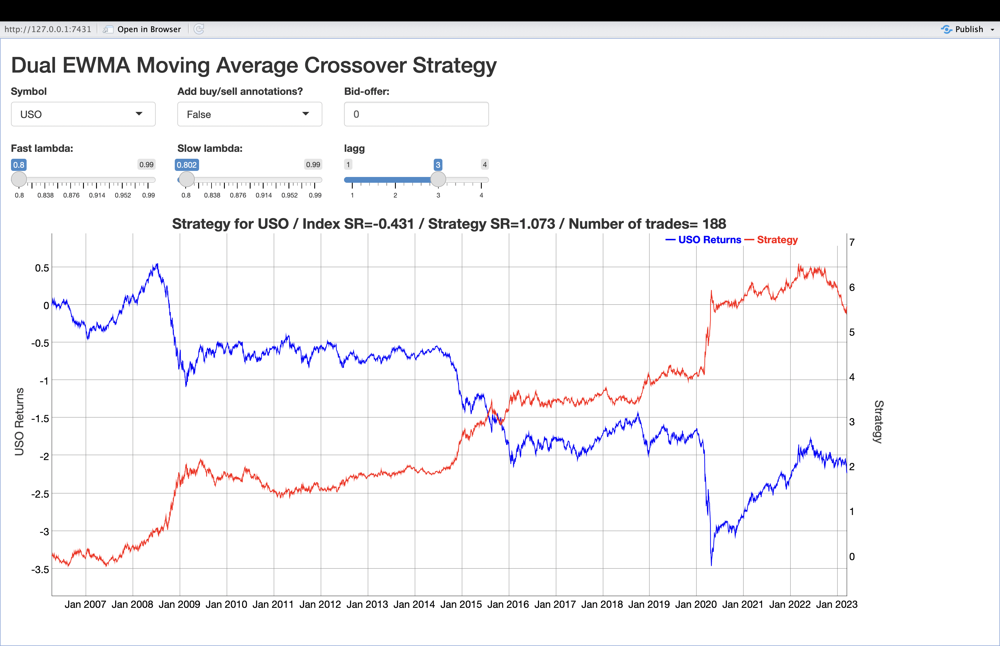

## Dual EWMA Moving Average Crossover Strategy: with Hampel Parameter Optimization

### Introduction
This repository contains a Shiny app for backtesting a Dual Exponentially Weighted Moving Average (EWMA) crossover strategy and R scripts for optimizing parameters of the Hampel trading strategy. These tools provide valuable insights into financial trading strategies and empower users to explore, visualize, and optimize their trading decisions.

### Results

### Part I: Dual EWMA Moving Average Crossover Strategy Shiny App
#### Shiny App Files
- `app_ewma_strat_hw.R`: This file contains the code for the Shiny app that enables users to backtest the Dual EWMA Moving Average Crossover Strategy interactively.
- `shiny_ewma_strat1.png`, `shiny_ewma_strat2.png`, `shiny_ewma_strat3.png`, `shiny_ewma_strat4.png`: Sample output images from the Shiny app demonstrating strategy performance for different ETFs.

#### How to Use the Shiny App
1. Run the `ewma_main.R` script in your R environment.
2. Access the Shiny app by opening the provided URL in your web browser.
3. Select an ETF, set decay parameters, adjust the lag, and optionally add buy/sell annotations.
4. Visualize the cumulative returns, strategy performance, and trading signals interactively.
5. Analyze the results to make data-driven trading decisions.

### Part II: Hampel Strategy Parameter Optimization
#### R Script for Hampel Strategy
- `hampel_strategy_parameter_optimization.R`: This script performs parameter optimization for the Hampel trading strategy. It explores different look-back and threshold values, simulates the strategy for each combination, and identifies optimal parameters based on Sharpe ratios.

#### How to Use the Hampel Strategy Parameter Optimization Script
1. Run the `hampel_strategy_parameter_optimization.R` script in your R environment.
2. The script will systematically explore various look-back and threshold values, simulate the Hampel strategy, and calculate Sharpe ratios.
3. Analyze the output to identify optimal parameters that yield superior risk-adjusted returns for the Hampel trading strategy.

### Conclusion
These tools provide traders and investors with valuable resources for strategy backtesting, visualization, and optimization. Utilize the Shiny app to interactively test the Dual EWMA (Exponential Moving Average) Crossover Strategy and explore different ETFs. Additionally, leverage the parameter optimization script to identify optimal parameters for the Hampel trading strategy, enhancing your trading decisions.

*Note: Users are encouraged to thoroughly understand the strategies and carefully consider market conditions before implementing any trading strategies in live trading environments.*
